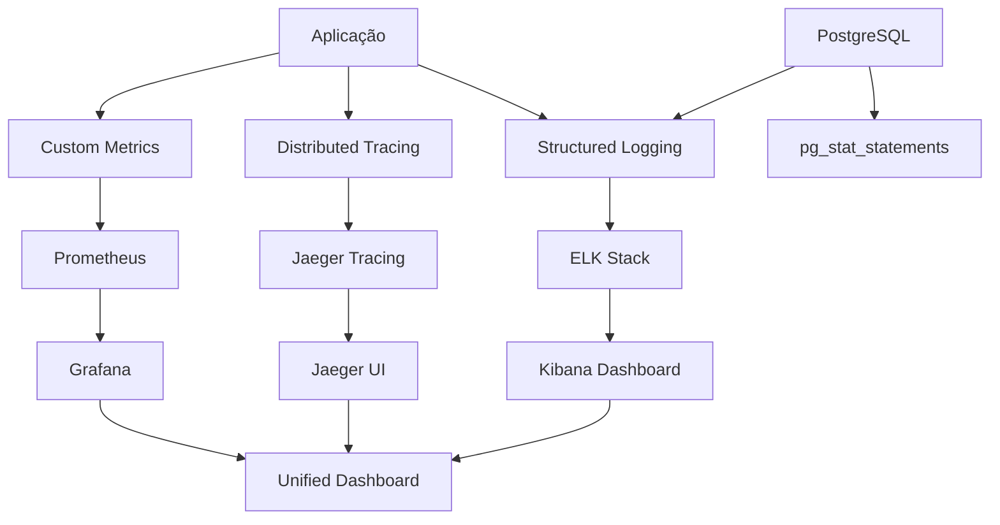

# Infraestrutura de Debug - SQLite para Neon PostgreSQL

## Visão Geral

Esta estratégia define a implementação completa de infraestrutura de debug, logging avançado, troubleshooting e diagnostic tools para suportar a operação pós-migração do sistema de licitações públicas.

## 🎯 Objetivos da Infraestrutura de Debug

### Metas Críticas
- **Observabilidade Completa**: Visibilidade total do sistema em produção
- **Debug Eficiente**: Ferramentas avançadas para identificação rápida de problemas
- **Troubleshooting Automatizado**: Diagnóstico automático de issues comuns
- **Performance Profiling**: Análise detalhada de performance em tempo real
- **Error Tracking**: Rastreamento e análise de erros sistemático

### Componentes Principais
- Sistema de logging distribuído
- APM (Application Performance Monitoring)
- Error tracking e alerting
- Database performance profiling
- Real-time debugging tools

## 🔧 Arquitetura de Debug

### Stack de Observabilidade


### Componentes de Debug

#### 1. Structured Logging
- **Format**: JSON structured logs
- **Levels**: DEBUG, INFO, WARN, ERROR, CRITICAL
- **Context**: Request ID, User ID, Session ID
- **Storage**: Elasticsearch para busca avançada

#### 2. Distributed Tracing
- **Tool**: Jaeger para tracing distribuído
- **Instrumentation**: SQLAlchemy, FastAPI, Redis
- **Correlation**: Request tracing end-to-end

#### 3. Error Tracking
- **Tool**: Sentry para error monitoring
- **Features**: Error grouping, performance monitoring
- **Alerting**: Integração com Slack/Email

#### 4. Database Profiling
- **pg_stat_statements**: Query performance analysis
- **Connection monitoring**: Pool usage tracking
- **Slow query detection**: Automatic alerts

## 📊 Sistema de Logging Avançado

### Configuração de Logging
```python
import logging
import json
import time
from datetime import datetime
from typing import Dict, Any, Optional
from contextvars import ContextVar
import structlog
from pythonjsonlogger import jsonlogger

# Context variables for request tracing
request_id_var: ContextVar[Optional[str]] = ContextVar('request_id', default=None)
user_id_var: ContextVar[Optional[str]] = ContextVar('user_id', default=None)
session_id_var: ContextVar[Optional[str]] = ContextVar('session_id', default=None)

class CustomJSONFormatter(jsonlogger.JsonFormatter):
    """Custom JSON formatter with enhanced context"""
    
    def add_fields(self, log_record: Dict[str, Any], record: logging.LogRecord, message_dict: Dict[str, Any]):
        super().add_fields(log_record, record, message_dict)
        
        # Add timestamp
        log_record['timestamp'] = datetime.utcnow().isoformat()
        log_record['level'] = record.levelname
        log_record['logger'] = record.name
        
        # Add request context
        log_record['request_id'] = request_id_var.get()
        log_record['user_id'] = user_id_var.get()
        log_record['session_id'] = session_id_var.get()
        
        # Add process info
        import os
        log_record['process_id'] = os.getpid()
        log_record['thread_id'] = record.thread
        
        # Add source code info
        log_record['filename'] = record.filename
        log_record['function'] = record.funcName
        log_record['line_number'] = record.lineno

def setup_logging():
    """Setup structured logging configuration"""
    
    # Configure structlog
    structlog.configure(
        processors=[
            structlog.contextvars.merge_contextvars,
            structlog.processors.TimeStamper(fmt="iso"),
            structlog.processors.add_log_level,
            structlog.processors.JSONRenderer()
        ],
        wrapper_class=structlog.make_filtering_bound_logger(30),  # INFO level
        logger_factory=structlog.WriteLoggerFactory(),
        cache_logger_on_first_use=True,
    )
    
    # Configure standard logging
    logger = logging.getLogger()
    logger.setLevel(logging.INFO)
    
    # Console handler with JSON formatting
    console_handler = logging.StreamHandler()
    console_formatter = CustomJSONFormatter(
        fmt='%(timestamp)s %(level)s %(logger)s %(message)s'
    )
    console_handler.setFormatter(console_formatter)
    logger.addHandler(console_handler)
    
    # File handler for persistent logging
    file_handler = logging.FileHandler('/var/log/licitacoes/application.log')
    file_handler.setFormatter(console_formatter)
    logger.addHandler(file_handler)
    
    return logger

# Logger instance
logger = setup_logging()
```

### Middleware de Logging
```python
from fastapi import Request, Response
from fastapi.middleware.base import BaseHTTPMiddleware
import uuid
import time

class LoggingMiddleware(BaseHTTPMiddleware):
    """Middleware for request/response logging"""
    
    async def dispatch(self, request: Request, call_next):
        # Generate request ID
        request_id = str(uuid.uuid4())
        request_id_var.set(request_id)
        
        start_time = time.time()
        
        # Log request
        logger.info(
            "Request started",
            extra={
                "event": "request_start",
                "method": request.method,
                "url": str(request.url),
                "client_ip": request.client.host,
                "user_agent": request.headers.get("user-agent"),
                "content_length": request.headers.get("content-length")
            }
        )
        
        try:
            # Process request
            response = await call_next(request)
            
            # Calculate duration
            duration = time.time() - start_time
            
            # Log response
            logger.info(
                "Request completed",
                extra={
                    "event": "request_complete",
                    "status_code": response.status_code,
                    "duration_ms": round(duration * 1000, 2),
                    "response_size": response.headers.get("content-length")
                }
            )
            
            # Add request ID to response headers
            response.headers["X-Request-ID"] = request_id
            
            return response
            
        except Exception as e:
            duration = time.time() - start_time
            
            # Log error
            logger.error(
                "Request failed",
                extra={
                    "event": "request_error",
                    "error_type": type(e).__name__,
                    "error_message": str(e),
                    "duration_ms": round(duration * 1000, 2)
                },
                exc_info=True
            )
            raise
```

## 🔍 Distributed Tracing

### Jaeger Integration
```python
import opentelemetry.trace as trace
from opentelemetry.exporter.jaeger.thrift import JaegerExporter
from opentelemetry.sdk.trace import TracerProvider
from opentelemetry.sdk.trace.export import BatchSpanProcessor
from opentelemetry.instrumentation.fastapi import FastAPIInstrumentor
from opentelemetry.instrumentation.sqlalchemy import SQLAlchemyInstrumentor
from opentelemetry.instrumentation.redis import RedisInstrumentor

def setup_tracing():
    """Setup distributed tracing with Jaeger"""
    
    # Configure tracer
    trace.set_tracer_provider(TracerProvider())
    tracer = trace.get_tracer(__name__)
    
    # Configure Jaeger exporter
    jaeger_exporter = JaegerExporter(
        agent_host_name="jaeger-agent",
        agent_port=6831,
    )
    
    # Add span processor
    span_processor = BatchSpanProcessor(jaeger_exporter)
    trace.get_tracer_provider().add_span_processor(span_processor)
    
    return tracer

def instrument_app(app):
    """Instrument FastAPI app with tracing"""
    
    # Instrument FastAPI
    FastAPIInstrumentor.instrument_app(app)
    
    # Instrument SQLAlchemy
    SQLAlchemyInstrumentor().instrument()
    
    # Instrument Redis
    RedisInstrumentor().instrument()

# Custom tracing decorator
def trace_function(operation_name: str = None):
    """Decorator to trace function execution"""
    def decorator(func):
        def wrapper(*args, **kwargs):
            tracer = trace.get_tracer(__name__)
            name = operation_name or f"{func.__module__}.{func.__name__}"
            
            with tracer.start_as_current_span(name) as span:
                try:
                    # Add function metadata
                    span.set_attribute("function.name", func.__name__)
                    span.set_attribute("function.module", func.__module__)
                    
                    # Execute function
                    result = func(*args, **kwargs)
                    
                    # Mark as successful
                    span.set_status(trace.StatusCode.OK)
                    return result
                    
                except Exception as e:
                    # Record error
                    span.record_exception(e)
                    span.set_status(trace.StatusCode.ERROR, str(e))
                    raise
        
        return wrapper
    return decorator
```

## 🚨 Error Tracking e Monitoring

### Sentry Integration
```python
import sentry_sdk
from sentry_sdk.integrations.sqlalchemy import SqlalchemyIntegration
from sentry_sdk.integrations.fastapi import FastApiIntegration
from sentry_sdk.integrations.redis import RedisIntegration
from sentry_sdk.integrations.logging import LoggingIntegration

def setup_sentry():
    """Setup Sentry error tracking"""
    
    # Configure logging integration
    logging_integration = LoggingIntegration(
        level=logging.INFO,        # Capture info and above as breadcrumbs
        event_level=logging.ERROR  # Send errors as events
    )
    
    sentry_sdk.init(
        dsn="YOUR_SENTRY_DSN",
        integrations=[
            FastApiIntegration(),
            SqlalchemyIntegration(),
            RedisIntegration(),
            logging_integration,
        ],
        traces_sample_rate=0.1,  # 10% of transactions
        profiles_sample_rate=0.1,  # 10% for profiling
        environment="production",
        release="migration-v1.0.0"
    )

class ErrorHandler:
    """Advanced error handling with context"""
    
    @staticmethod
    def capture_exception(error: Exception, extra_context: Dict[str, Any] = None):
        """Capture exception with additional context"""
        
        with sentry_sdk.push_scope() as scope:
            # Add request context
            scope.set_tag("request_id", request_id_var.get())
            scope.set_user({"id": user_id_var.get()})
            
            # Add extra context
            if extra_context:
                for key, value in extra_context.items():
                    scope.set_extra(key, value)
            
            # Capture exception
            sentry_sdk.capture_exception(error)
    
    @staticmethod
    def capture_message(message: str, level: str = "info", extra_context: Dict[str, Any] = None):
        """Capture custom message"""
        
        with sentry_sdk.push_scope() as scope:
            scope.set_tag("request_id", request_id_var.get())
            
            if extra_context:
                for key, value in extra_context.items():
                    scope.set_extra(key, value)
            
            sentry_sdk.capture_message(message, level)
```

## 💾 Database Performance Profiling

### PostgreSQL Monitoring
```python
import asyncio
import psycopg2
from typing import List, Dict, Any
from dataclasses import dataclass
from datetime import datetime, timedelta

@dataclass
class SlowQuery:
    """Slow query information"""
    query: str
    calls: int
    total_time: float
    mean_time: float
    rows: int
    query_hash: str
    first_seen: datetime

class DatabaseProfiler:
    """Database performance profiler"""
    
    def __init__(self, database_url: str):
        self.database_url = database_url
        self.slow_query_threshold = 1000  # milliseconds
        
    async def get_slow_queries(self, hours: int = 1) -> List[SlowQuery]:
        """Get slow queries from pg_stat_statements"""
        
        query = """
        SELECT 
            query,
            calls,
            total_exec_time,
            mean_exec_time,
            rows,
            queryid,
            stats_since
        FROM pg_stat_statements 
        WHERE mean_exec_time > %s
        AND stats_since > NOW() - INTERVAL '%s hours'
        ORDER BY mean_exec_time DESC
        LIMIT 50
        """
        
        conn = psycopg2.connect(self.database_url)
        cursor = conn.cursor()
        
        cursor.execute(query, (self.slow_query_threshold, hours))
        results = cursor.fetchall()
        
        slow_queries = []
        for row in results:
            slow_queries.append(SlowQuery(
                query=row[0],
                calls=row[1],
                total_time=row[2],
                mean_time=row[3],
                rows=row[4],
                query_hash=str(row[5]),
                first_seen=row[6]
            ))
        
        cursor.close()
        conn.close()
        
        return slow_queries
    
    async def get_connection_stats(self) -> Dict[str, Any]:
        """Get connection pool statistics"""
        
        query = """
        SELECT 
            count(*) as total_connections,
            count(*) FILTER (WHERE state = 'active') as active_connections,
            count(*) FILTER (WHERE state = 'idle') as idle_connections,
            count(*) FILTER (WHERE state = 'idle in transaction') as idle_in_transaction,
            max(now() - backend_start) as longest_connection_age,
            max(now() - query_start) as longest_query_time
        FROM pg_stat_activity
        WHERE datname = current_database()
        """
        
        conn = psycopg2.connect(self.database_url)
        cursor = conn.cursor()
        
        cursor.execute(query)
        result = cursor.fetchone()
        
        stats = {
            'total_connections': result[0],
            'active_connections': result[1],
            'idle_connections': result[2],
            'idle_in_transaction': result[3],
            'longest_connection_age': result[4].total_seconds() if result[4] else 0,
            'longest_query_time': result[5].total_seconds() if result[5] else 0
        }
        
        cursor.close()
        conn.close()
        
        return stats
    
    async def get_table_stats(self) -> List[Dict[str, Any]]:
        """Get table statistics"""
        
        query = """
        SELECT 
            schemaname,
            tablename,
            n_tup_ins as inserts,
            n_tup_upd as updates,
            n_tup_del as deletes,
            n_live_tup as live_tuples,
            n_dead_tup as dead_tuples,
            last_vacuum,
            last_autovacuum,
            last_analyze,
            last_autoanalyze
        FROM pg_stat_user_tables
        ORDER BY (n_tup_ins + n_tup_upd + n_tup_del) DESC
        """
        
        conn = psycopg2.connect(self.database_url)
        cursor = conn.cursor()
        
        cursor.execute(query)
        results = cursor.fetchall()
        
        table_stats = []
        for row in results:
            table_stats.append({
                'schema': row[0],
                'table': row[1],
                'inserts': row[2],
                'updates': row[3],
                'deletes': row[4],
                'live_tuples': row[5],
                'dead_tuples': row[6],
                'last_vacuum': row[7],
                'last_autovacuum': row[8],
                'last_analyze': row[9],
                'last_autoanalyze': row[10]
            })
        
        cursor.close()
        conn.close()
        
        return table_stats
```

## 🔧 Debug Tools e Utilities

### Debug Dashboard
```python
from fastapi import FastAPI, Depends
from fastapi.responses import HTMLResponse
import json

class DebugDashboard:
    """Real-time debug dashboard"""
    
    def __init__(self, app: FastAPI):
        self.app = app
        self.setup_routes()
        
    def setup_routes(self):
        """Setup debug routes"""
        
        @self.app.get("/debug/health")
        async def health_check():
            """Comprehensive health check"""
            return {
                "status": "healthy",
                "timestamp": datetime.now().isoformat(),
                "version": "1.0.0",
                "database": await self.check_database(),
                "cache": await self.check_cache(),
                "external_apis": await self.check_external_apis()
            }
        
        @self.app.get("/debug/metrics")
        async def get_debug_metrics():
            """Get current debug metrics"""
            return {
                "slow_queries": await self.get_slow_queries(),
                "connection_stats": await self.get_connection_stats(),
                "error_summary": await self.get_error_summary(),
                "performance_stats": await self.get_performance_stats()
            }
        
        @self.app.get("/debug/logs")
        async def get_recent_logs(level: str = "ERROR", limit: int = 100):
            """Get recent logs by level"""
            return await self.get_logs_by_level(level, limit)
        
        @self.app.get("/debug/dashboard", response_class=HTMLResponse)
        async def debug_dashboard():
            """HTML debug dashboard"""
            return self.render_dashboard()
    
    def render_dashboard(self) -> str:
        """Render HTML debug dashboard"""
        return """
        <!DOCTYPE html>
        <html>
        <head>
            <title>Licitações - Debug Dashboard</title>
            <style>
                body { font-family: Arial, sans-serif; margin: 20px; }
                .metric-card { 
                    border: 1px solid #ddd; 
                    padding: 15px; 
                    margin: 10px 0; 
                    border-radius: 5px;
                    background: #f9f9f9;
                }
                .error { background: #ffe6e6; border-color: #ff9999; }
                .warning { background: #fff3cd; border-color: #ffc107; }
                .success { background: #d4edda; border-color: #28a745; }
                .refresh-btn {
                    background: #007bff;
                    color: white;
                    border: none;
                    padding: 10px 20px;
                    cursor: pointer;
                    border-radius: 3px;
                }
            </style>
        </head>
        <body>
            <h1>🔍 Licitações Debug Dashboard</h1>
            
            <button class="refresh-btn" onclick="window.location.reload()">
                Refresh
            </button>
            
            <div id="metrics">
                <div class="metric-card">
                    <h3>System Status</h3>
                    <p>Loading...</p>
                </div>
                
                <div class="metric-card">
                    <h3>Database Performance</h3>
                    <p>Loading...</p>
                </div>
                
                <div class="metric-card">
                    <h3>Recent Errors</h3>
                    <p>Loading...</p>
                </div>
                
                <div class="metric-card">
                    <h3>Slow Queries</h3>
                    <p>Loading...</p>
                </div>
            </div>
            
            <script>
                // Auto-refresh every 30 seconds
                setTimeout(function(){ 
                    window.location.reload(); 
                }, 30000);
                
                // Load metrics via AJAX
                fetch('/debug/metrics')
                    .then(response => response.json())
                    .then(data => {
                        console.log('Debug metrics loaded:', data);
                        // Update dashboard with real data
                    })
                    .catch(error => console.error('Error loading metrics:', error));
            </script>
        </body>
        </html>
        """

# Query Performance Analyzer
class QueryAnalyzer:
    """Analyze and optimize slow queries"""
    
    def __init__(self, database_url: str):
        self.database_url = database_url
    
    async def explain_query(self, query: str) -> Dict[str, Any]:
        """Get query execution plan"""
        
        explain_query = f"EXPLAIN (ANALYZE, BUFFERS, FORMAT JSON) {query}"
        
        conn = psycopg2.connect(self.database_url)
        cursor = conn.cursor()
        
        cursor.execute(explain_query)
        result = cursor.fetchone()[0][0]
        
        cursor.close()
        conn.close()
        
        return {
            "execution_plan": result,
            "total_cost": result.get("Total Cost", 0),
            "actual_time": result.get("Actual Total Time", 0),
            "shared_hit_blocks": result.get("Shared Hit Blocks", 0),
            "shared_read_blocks": result.get("Shared Read Blocks", 0)
        }
    
    def suggest_optimizations(self, query_plan: Dict[str, Any]) -> List[str]:
        """Suggest query optimizations based on execution plan"""
        
        suggestions = []
        
        # High cost operations
        if query_plan.get("total_cost", 0) > 1000:
            suggestions.append("Consider adding indexes for high-cost operations")
        
        # Sequential scans
        plan_text = str(query_plan.get("execution_plan", ""))
        if "Seq Scan" in plan_text:
            suggestions.append("Sequential scans detected - consider adding indexes")
        
        # High shared read blocks (disk I/O)
        if query_plan.get("shared_read_blocks", 0) > 1000:
            suggestions.append("High disk I/O detected - consider optimizing indexes or increasing shared_buffers")
        
        return suggestions
```

## 📈 Real-time Monitoring Dashboard

### Grafana Configuration
```yaml
# grafana/dashboards/debug-dashboard.json
{
  "dashboard": {
    "title": "Licitações Debug Dashboard",
    "panels": [
      {
        "title": "Error Rate",
        "type": "stat",
        "targets": [
          {
            "expr": "rate(http_requests_total{status=~\"4..|5..\"}[5m])",
            "legendFormat": "Error Rate"
          }
        ]
      },
      {
        "title": "Slow Queries",
        "type": "table",
        "targets": [
          {
            "expr": "pg_stat_statements_mean_time_seconds > 1",
            "legendFormat": "Slow Queries"
          }
        ]
      },
      {
        "title": "Database Connections",
        "type": "graph",
        "targets": [
          {
            "expr": "pg_stat_activity_count",
            "legendFormat": "Active Connections"
          }
        ]
      },
      {
        "title": "Memory Usage",
        "type": "graph",
        "targets": [
          {
            "expr": "process_resident_memory_bytes",
            "legendFormat": "Memory Usage"
          }
        ]
      }
    ]
  }
}
```

## 🛠️ Troubleshooting Automation

### Automated Issue Detection
```python
class TroubleshootingEngine:
    """Automated troubleshooting and issue detection"""
    
    def __init__(self):
        self.issue_detectors = [
            self.detect_connection_issues,
            self.detect_slow_queries,
            self.detect_memory_leaks,
            self.detect_deadlocks,
            self.detect_cache_issues
        ]
    
    async def run_diagnostics(self) -> Dict[str, Any]:
        """Run all diagnostic checks"""
        
        results = {
            "timestamp": datetime.now().isoformat(),
            "issues_found": [],
            "recommendations": [],
            "system_health": "healthy"
        }
        
        for detector in self.issue_detectors:
            try:
                issue = await detector()
                if issue:
                    results["issues_found"].append(issue)
                    results["system_health"] = "degraded" if issue["severity"] == "warning" else "critical"
                    
            except Exception as e:
                logger.error(f"Diagnostic check failed: {detector.__name__}", exc_info=True)
        
        # Generate recommendations
        results["recommendations"] = self.generate_recommendations(results["issues_found"])
        
        return results
    
    async def detect_connection_issues(self) -> Optional[Dict[str, Any]]:
        """Detect database connection issues"""
        
        stats = await DatabaseProfiler(DATABASE_URL).get_connection_stats()
        
        if stats["active_connections"] > 80:
            return {
                "type": "connection_saturation",
                "severity": "critical" if stats["active_connections"] > 90 else "warning",
                "message": f"High connection usage: {stats['active_connections']}/100",
                "recommendation": "Consider increasing connection pool size or optimizing connection usage"
            }
        
        if stats["idle_in_transaction"] > 10:
            return {
                "type": "idle_transactions",
                "severity": "warning",
                "message": f"High idle in transaction: {stats['idle_in_transaction']}",
                "recommendation": "Review transaction handling and ensure proper cleanup"
            }
        
        return None
    
    async def detect_slow_queries(self) -> Optional[Dict[str, Any]]:
        """Detect slow query issues"""
        
        profiler = DatabaseProfiler(DATABASE_URL)
        slow_queries = await profiler.get_slow_queries(hours=1)
        
        if len(slow_queries) > 10:
            return {
                "type": "slow_queries",
                "severity": "warning",
                "message": f"Multiple slow queries detected: {len(slow_queries)}",
                "recommendation": "Review and optimize slow queries, consider adding indexes"
            }
        
        # Check for extremely slow queries
        very_slow = [q for q in slow_queries if q.mean_time > 5000]  # > 5 seconds
        if very_slow:
            return {
                "type": "very_slow_queries",
                "severity": "critical",
                "message": f"Extremely slow queries detected: {len(very_slow)}",
                "recommendation": "Immediate attention required for query optimization"
            }
        
        return None
    
    def generate_recommendations(self, issues: List[Dict[str, Any]]) -> List[str]:
        """Generate recommendations based on detected issues"""
        
        recommendations = []
        
        # Connection issues
        if any(i["type"] == "connection_saturation" for i in issues):
            recommendations.append("Scale database connections or optimize connection pooling")
        
        # Query performance
        if any(i["type"] in ["slow_queries", "very_slow_queries"] for i in issues):
            recommendations.append("Run EXPLAIN ANALYZE on slow queries and add appropriate indexes")
        
        # Memory issues
        if any(i["type"] == "memory_leak" for i in issues):
            recommendations.append("Investigate memory usage patterns and potential leaks")
        
        return recommendations

# Automated recovery actions
class AutoRecovery:
    """Automated recovery for common issues"""
    
    @staticmethod
    async def kill_long_running_queries(threshold_minutes: int = 30):
        """Kill queries running longer than threshold"""
        
        query = """
        SELECT pg_terminate_backend(pid)
        FROM pg_stat_activity
        WHERE now() - query_start > interval '%s minutes'
        AND state = 'active'
        AND datname = current_database()
        AND pid != pg_backend_pid()
        """
        
        # Implementation would go here
        logger.info(f"Terminated long-running queries (>{threshold_minutes} min)")
    
    @staticmethod
    async def clear_idle_transactions():
        """Clear idle in transaction connections"""
        
        query = """
        SELECT pg_terminate_backend(pid)
        FROM pg_stat_activity
        WHERE state = 'idle in transaction'
        AND now() - state_change > interval '1 hour'
        AND datname = current_database()
        """
        
        # Implementation would go here
        logger.info("Cleared idle transactions")
```

Esta infraestrutura de debug fornece observabilidade completa, troubleshooting automatizado e ferramentas avançadas de diagnóstico para garantir operação estável do sistema pós-migração.