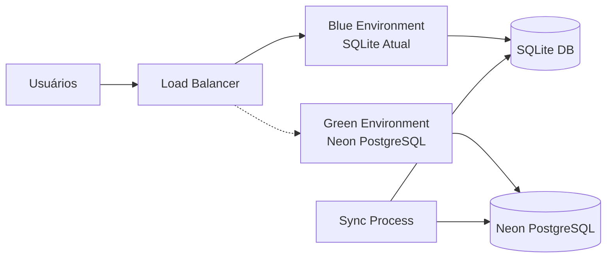

# Estratégia de Deployment em Produção - SQLite para Neon PostgreSQL

## Visão Geral

Esta estratégia define o plano completo para deployment da migração em produção, garantindo zero downtime, segurança máxima e capacidade de rollback rápido caso necessário.

## 🎯 Objetivos do Deployment

### Metas Críticas
- **Zero Downtime**: Migração sem interrupção do serviço
- **Data Integrity**: 100% integridade dos dados
- **Performance**: Manter ou melhorar performance atual
- **Rollback Capability**: Capacidade de rollback em < 5 minutos
- **Monitoring**: Visibilidade completa durante todo o processo
- **User Experience**: Transparente para usuários finais

### Métricas de Sucesso
- Downtime: 0 segundos
- Data Loss: 0%
- Performance Degradation: < 5% temporário
- Error Rate: < 0.1% durante migração
- Rollback Time: < 300 segundos se necessário

## 📋 Fases de Deployment

### Fase 1: Preparação (Semana -2 a -1)
- [ ] Configuração de infraestrutura Neon
- [ ] Setup de monitoramento e alertas
- [ ] Testes de integração final
- [ ] Preparação de scripts de rollback
- [ ] Comunicação com stakeholders

### Fase 2: Pré-Migração (Dia -1)
- [ ] Sincronização inicial de dados
- [ ] Validação de conectividade
- [ ] Backup completo do sistema atual
- [ ] Verificação de todos os scripts
- [ ] Freeze de features novas

### Fase 3: Migração Ativa (Dia 0)
- [ ] Blue-Green Deployment execution
- [ ] Migração de dados em tempo real
- [ ] Validação de integridade
- [ ] Switch de tráfego gradual
- [ ] Monitoramento intensivo

### Fase 4: Pós-Migração (Dia +1 a +7)
- [ ] Monitoramento 24/7
- [ ] Otimização de performance
- [ ] Coleta de feedback
- [ ] Cleanup de recursos antigos
- [ ] Documentação final

## 🏗️ Arquitetura de Deployment

### Blue-Green Deployment Strategy



### Componentes da Arquitetura

#### Production Environment (Blue)
- **Web Servers**: 3x instâncias atuais
- **Database**: SQLite atual
- **Load Balancer**: HAProxy/Nginx
- **Monitoring**: Sistema atual

#### New Environment (Green)
- **Web Servers**: 3x instâncias novas (Neon-ready)
- **Database**: Neon PostgreSQL
- **Cache Layer**: Redis Cluster
- **Connection Pool**: PgBouncer
- **Monitoring**: Enhanced monitoring stack

## 🔄 Estratégia de Migração

### 1. Sincronização Contínua

#### Data Sync Process
```python
class ContinuousDataSync:
    def __init__(self, sqlite_path: str, neon_url: str):
        self.sqlite = sqlite3.connect(sqlite_path)
        self.neon = create_engine(neon_url)
        self.sync_log = []
    
    async def start_continuous_sync(self):
        """Inicia sincronização contínua"""
        while self.sync_active:
            try:
                # 1. Identifica mudanças no SQLite
                changes = self.detect_changes()
                
                # 2. Aplica mudanças no Neon
                await self.apply_changes_to_neon(changes)
                
                # 3. Valida sincronização
                await self.validate_sync()
                
                await asyncio.sleep(10)  # Sync a cada 10 segundos
            except Exception as e:
                logger.error(f"Sync error: {e}")
                await self.handle_sync_error(e)
```

#### Change Detection
- **Timestamp-based**: Detecta registros modificados por `updated_at`
- **Checksum validation**: Valida integridade de dados
- **Incremental sync**: Apenas mudanças delta
- **Conflict resolution**: Resolve conflitos automaticamente

### 2. Traffic Migration Strategy

#### Gradual Traffic Switch
```yaml
# Traffic distribution phases
Phase 1: 95% SQLite, 5% Neon (validation)
Phase 2: 80% SQLite, 20% Neon (limited users)
Phase 3: 50% SQLite, 50% Neon (A/B testing)
Phase 4: 20% SQLite, 80% Neon (majority migration)
Phase 5: 0% SQLite, 100% Neon (complete switch)
```

#### Load Balancer Configuration
```nginx
upstream sqlite_backend {
    server app1.sqlite.local:8000 weight=20;
    server app2.sqlite.local:8000 weight=20;
    server app3.sqlite.local:8000 weight=20;
}

upstream neon_backend {
    server app1.neon.local:8000 weight=80;
    server app2.neon.local:8000 weight=80;
    server app3.neon.local:8000 weight=80;
}

server {
    location / {
        # Route based on user segment
        if ($http_x_user_segment = "beta") {
            proxy_pass http://neon_backend;
        }
        
        # Gradual rollout by percentage
        if ($request_id ~ ^[0-7]) {
            proxy_pass http://neon_backend;
        }
        
        proxy_pass http://sqlite_backend;
    }
}
```

## 🛡️ Estratégias de Segurança e Backup

### Pre-Migration Backup
```bash
#!/bin/bash
# Complete system backup before migration

BACKUP_DIR="/backups/pre-migration-$(date +%Y%m%d_%H%M%S)"
mkdir -p $BACKUP_DIR

# 1. Database backup
sqlite3 /path/to/production.db ".backup '$BACKUP_DIR/database.db'"
gzip "$BACKUP_DIR/database.db"

# 2. Application code backup
tar -czf "$BACKUP_DIR/application.tar.gz" /path/to/app

# 3. Configuration backup
cp -r /etc/nginx "$BACKUP_DIR/nginx_config"
cp -r /etc/systemd/system/licitacoes* "$BACKUP_DIR/systemd_config"

# 4. Logs backup
tar -czf "$BACKUP_DIR/logs.tar.gz" /var/log/licitacoes

# 5. Create backup manifest
cat > "$BACKUP_DIR/manifest.txt" << EOF
Backup Date: $(date)
Database Size: $(du -h $BACKUP_DIR/database.db.gz)
Application Size: $(du -h $BACKUP_DIR/application.tar.gz)
System: $(uname -a)
EOF

echo "Backup completed: $BACKUP_DIR"
```

### Data Validation Scripts
```python
class DataIntegrityValidator:
    """Valida integridade dos dados durante migração"""
    
    def __init__(self, sqlite_conn, neon_conn):
        self.sqlite = sqlite_conn
        self.neon = neon_conn
        self.validation_results = []
    
    async def validate_table_counts(self):
        """Valida contagem de registros por tabela"""
        tables = ['users', 'companies', 'opportunities', 'proposals']
        
        for table in tables:
            sqlite_count = self.sqlite.execute(f"SELECT COUNT(*) FROM {table}").fetchone()[0]
            neon_count = await self.neon.execute(f"SELECT COUNT(*) FROM {table}")
            
            if sqlite_count != neon_count:
                self.validation_results.append({
                    'table': table,
                    'status': 'FAILED',
                    'sqlite_count': sqlite_count,
                    'neon_count': neon_count,
                    'difference': abs(sqlite_count - neon_count)
                })
            else:
                self.validation_results.append({
                    'table': table,
                    'status': 'PASSED',
                    'count': sqlite_count
                })
    
    async def validate_data_checksums(self):
        """Valida checksums de dados críticos"""
        critical_queries = [
            "SELECT md5(string_agg(email, '')) FROM users ORDER BY id",
            "SELECT md5(string_agg(cnpj, '')) FROM companies ORDER BY id",
            "SELECT md5(string_agg(title, '')) FROM opportunities ORDER BY id"
        ]
        
        for query in critical_queries:
            sqlite_hash = self.sqlite.execute(query.replace('md5', 'hex')).fetchone()[0]
            neon_hash = await self.neon.execute(query)
            
            if sqlite_hash != neon_hash:
                self.validation_results.append({
                    'query': query,
                    'status': 'CHECKSUM_MISMATCH',
                    'sqlite_hash': sqlite_hash,
                    'neon_hash': neon_hash
                })
```

## 📊 Monitoramento Durante Deployment

### Real-time Monitoring Dashboard

#### Key Metrics to Monitor
```python
DEPLOYMENT_METRICS = {
    # System Health
    'cpu_usage': {'threshold': 80, 'critical': 95},
    'memory_usage': {'threshold': 85, 'critical': 95},
    'disk_usage': {'threshold': 80, 'critical': 90},
    
    # Application Metrics
    'response_time_p95': {'threshold': 500, 'critical': 2000},  # milliseconds
    'error_rate': {'threshold': 1, 'critical': 5},  # percentage
    'throughput': {'min_threshold': 100},  # requests/second
    
    # Database Metrics
    'connection_pool_usage': {'threshold': 80, 'critical': 95},
    'query_execution_time': {'threshold': 1000, 'critical': 5000},
    'cache_hit_ratio': {'min_threshold': 80},
    
    # Migration Specific
    'sync_lag': {'threshold': 60, 'critical': 300},  # seconds
    'data_integrity_score': {'min_threshold': 99.9},  # percentage
    'traffic_distribution': {}  # current split
}
```

#### Alerting System
```python
class DeploymentAlerting:
    def __init__(self, webhook_url: str, email_list: List[str]):
        self.webhook_url = webhook_url
        self.email_list = email_list
        self.alert_history = []
    
    async def check_and_alert(self, metrics: Dict[str, float]):
        """Check metrics and send alerts if thresholds exceeded"""
        alerts = []
        
        for metric_name, value in metrics.items():
            config = DEPLOYMENT_METRICS.get(metric_name, {})
            
            if 'critical' in config and value >= config['critical']:
                alerts.append({
                    'level': 'CRITICAL',
                    'metric': metric_name,
                    'value': value,
                    'threshold': config['critical']
                })
            elif 'threshold' in config and value >= config['threshold']:
                alerts.append({
                    'level': 'WARNING',
                    'metric': metric_name,
                    'value': value,
                    'threshold': config['threshold']
                })
        
        if alerts:
            await self.send_alerts(alerts)
    
    async def send_alerts(self, alerts: List[Dict]):
        """Send alerts through multiple channels"""
        for alert in alerts:
            # Send to Slack/Teams
            await self.send_webhook_alert(alert)
            
            # Send email for critical alerts
            if alert['level'] == 'CRITICAL':
                await self.send_email_alert(alert)
```

## 🔄 Estratégia de Rollback

### Automated Rollback Triggers
```python
ROLLBACK_CONDITIONS = {
    'error_rate_spike': {
        'threshold': 10,  # percentage
        'duration': 300,  # seconds
        'action': 'immediate_rollback'
    },
    'response_time_degradation': {
        'threshold': 5000,  # milliseconds
        'duration': 180,
        'action': 'gradual_rollback'
    },
    'data_integrity_failure': {
        'threshold': 99,  # percentage
        'duration': 0,
        'action': 'immediate_rollback'
    },
    'database_connection_failure': {
        'threshold': 50,  # percentage failed connections
        'duration': 60,
        'action': 'immediate_rollback'
    }
}
```

### Rollback Execution Script
```bash
#!/bin/bash
# Emergency rollback script

set -e

ROLLBACK_LOG="/var/log/rollback-$(date +%Y%m%d_%H%M%S).log"
exec 1> >(tee -a $ROLLBACK_LOG)
exec 2>&1

echo "=== EMERGENCY ROLLBACK INITIATED ==="
echo "Timestamp: $(date)"
echo "Initiated by: ${USER:-system}"
echo "Reason: ${ROLLBACK_REASON:-manual}"

# 1. Immediate traffic switch to SQLite
echo "Step 1: Switching traffic back to SQLite..."
curl -X POST http://load-balancer:8080/admin/switch-to-sqlite
sleep 5

# 2. Stop Neon application instances
echo "Step 2: Stopping Neon application instances..."
systemctl stop licitacoes-neon@{1,2,3}

# 3. Restore SQLite application if needed
echo "Step 3: Ensuring SQLite instances are healthy..."
systemctl start licitacoes-sqlite@{1,2,3}
systemctl status licitacoes-sqlite@{1,2,3}

# 4. Validate rollback
echo "Step 4: Validating rollback..."
for i in {1..5}; do
    if curl -f -s http://localhost:8000/health > /dev/null; then
        echo "Health check passed"
        break
    else
        echo "Health check failed, attempt $i/5"
        sleep 10
    fi
done

# 5. Send notifications
echo "Step 5: Sending rollback notifications..."
curl -X POST -H "Content-Type: application/json" \
    -d "{\"text\": \"🚨 ROLLBACK COMPLETED: SQLite system restored at $(date)\"}" \
    $SLACK_WEBHOOK_URL

echo "=== ROLLBACK COMPLETED ==="
echo "Total time: $SECONDS seconds"
```

## 🔧 Deployment Automation

### CI/CD Pipeline Integration
```yaml
# .github/workflows/production-deployment.yml
name: Production Deployment

on:
  workflow_dispatch:
    inputs:
      deployment_phase:
        description: 'Deployment phase (1-5)'
        required: true
        type: choice
        options:
          - 'phase-1-validation'
          - 'phase-2-limited'
          - 'phase-3-ab-test'
          - 'phase-4-majority'
          - 'phase-5-complete'

jobs:
  deploy:
    runs-on: ubuntu-latest
    environment: production
    
    steps:
    - uses: actions/checkout@v3
    
    - name: Setup Environment
      run: |
        echo "DEPLOYMENT_PHASE=${{ github.event.inputs.deployment_phase }}" >> $GITHUB_ENV
        echo "DEPLOYMENT_ID=$(date +%Y%m%d_%H%M%S)" >> $GITHUB_ENV
    
    - name: Pre-deployment Validation
      run: |
        # Run pre-deployment checks
        python scripts/pre_deployment_check.py
        
        # Validate Neon connectivity
        python scripts/validate_neon_connection.py
        
        # Check system resources
        python scripts/check_system_resources.py
    
    - name: Execute Deployment Phase
      run: |
        case $DEPLOYMENT_PHASE in
          "phase-1-validation")
            python scripts/deploy_phase_1.py
            ;;
          "phase-2-limited")
            python scripts/deploy_phase_2.py
            ;;
          "phase-3-ab-test")
            python scripts/deploy_phase_3.py
            ;;
          "phase-4-majority")
            python scripts/deploy_phase_4.py
            ;;
          "phase-5-complete")
            python scripts/deploy_phase_5.py
            ;;
        esac
    
    - name: Post-deployment Validation
      run: |
        # Wait for systems to stabilize
        sleep 60
        
        # Run health checks
        python scripts/health_check.py
        
        # Validate data integrity
        python scripts/validate_data_integrity.py
        
        # Performance validation
        python scripts/performance_validation.py
    
    - name: Send Notifications
      if: always()
      run: |
        python scripts/send_deployment_notification.py \
          --phase "$DEPLOYMENT_PHASE" \
          --status "${{ job.status }}" \
          --deployment-id "$DEPLOYMENT_ID"
```

### Infrastructure as Code
```terraform
# infrastructure/production/main.tf
terraform {
  required_providers {
    neon = {
      source = "kislerdm/neon"
      version = "~> 0.2"
    }
  }
}

# Neon Database
resource "neon_database" "licitacoes_prod" {
  project_id = var.neon_project_id
  name       = "licitacoes_production"
  
  # Production settings
  settings = {
    wal_level                = "replica"
    max_connections         = 200
    shared_buffers          = "2GB"
    effective_cache_size    = "6GB"
    maintenance_work_mem    = "512MB"
    work_mem               = "32MB"
    
    # Performance optimizations
    random_page_cost       = 1.1
    effective_io_concurrency = 300
    max_worker_processes   = 16
    max_parallel_workers   = 16
  }
}

# Read Replicas for Load Distribution
resource "neon_database_branch" "read_replica_1" {
  project_id = var.neon_project_id
  parent_id  = neon_database.licitacoes_prod.id
  name       = "read-replica-1"
}

resource "neon_database_branch" "read_replica_2" {
  project_id = var.neon_project_id
  parent_id  = neon_database.licitacoes_prod.id
  name       = "read-replica-2"
}

# Monitoring and Alerting
resource "neon_project_settings" "monitoring" {
  project_id = var.neon_project_id
  
  settings = {
    enable_logical_replication = true
    enable_pooler_mode        = true
    pooler_mode              = "transaction"
  }
}
```

## 📅 Timeline Detalhado

### Semana -2: Preparação Inicial
**Segunda-feira**
- [ ] Setup infraestrutura Neon completa
- [ ] Configuração de monitoramento
- [ ] Testes de conectividade

**Terça-feira**
- [ ] Deployment de aplicação Neon em staging
- [ ] Testes de integração completos
- [ ] Validação de performance

**Quarta-feira**
- [ ] Setup de sincronização de dados
- [ ] Testes de backup e restore
- [ ] Configuração de alertas

**Quinta-feira**
- [ ] Rehearsal de deployment completo
- [ ] Testes de rollback
- [ ] Documentação final

**Sexta-feira**
- [ ] Review final com equipe
- [ ] Aprovação de stakeholders
- [ ] Preparação para semana final

### Semana -1: Preparação Final
**Segunda-feira**
- [ ] Freeze de features novas
- [ ] Backup completo do sistema
- [ ] Início de sincronização contínua

**Terça-feira**
- [ ] Validação de sincronização
- [ ] Testes finais de performance
- [ ] Preparação de scripts de deployment

**Quarta-feira**
- [ ] Comunicação com usuários
- [ ] Setup de monitoramento 24/7
- [ ] Preparação de equipe de suporte

**Quinta-feira**
- [ ] Rehearsal final
- [ ] Validação de todos os scripts
- [ ] Preparação de ambiente de rollback

**Sexta-feira**
- [ ] Go/No-go decision
- [ ] Preparação final
- [ ] Comunicação com stakeholders

### Dia 0: Deployment
**00:00 - 06:00**
- [ ] Início de fase 1 (5% tráfego)
- [ ] Monitoramento intensivo
- [ ] Validação de funcionalidades críticas

**06:00 - 12:00**
- [ ] Fase 2 (20% tráfego)
- [ ] Coleta de métricas
- [ ] Ajustes de performance

**12:00 - 18:00**
- [ ] Fase 3 (50% tráfego)
- [ ] A/B testing
- [ ] Validação de experiência do usuário

**18:00 - 24:00**
- [ ] Fase 4 (80% tráfego)
- [ ] Preparação para switch completo
- [ ] Validação final

### Dia +1: Finalização
**00:00 - 06:00**
- [ ] Fase 5 (100% tráfego)
- [ ] Monitoramento crítico
- [ ] Switch completo para Neon

**06:00 - 18:00**
- [ ] Monitoramento 24/7
- [ ] Coleta de feedback
- [ ] Otimizações menores

**18:00 - 24:00**
- [ ] Relatório de deployment
- [ ] Cleanup inicial
- [ ] Comunicação de sucesso

## ✅ Critérios de Sucesso

### Critérios Técnicos
- [ ] Zero data loss durante migração
- [ ] Downtime < 1 minuto (apenas para switch final)
- [ ] Error rate < 0.1% durante todo processo
- [ ] Response time degradation < 5%
- [ ] 100% das funcionalidades operacionais

### Critérios de Negócio
- [ ] Usuários conseguem acessar sistema normalmente
- [ ] Todas as integrações funcionando
- [ ] Performance igual ou superior
- [ ] Capacidade de rollback em < 5 minutos
- [ ] Monitoramento e alertas operacionais

### Critérios de Compliance
- [ ] Dados pessoais protegidos (LGPD)
- [ ] Logs de auditoria preservados
- [ ] Backup e recovery testados
- [ ] Documentação completa
- [ ] Aprovação de stakeholders

## 🚨 Plano de Contingência

### Cenário 1: Alta Taxa de Erro
**Condição**: Error rate > 5% por mais de 5 minutos
**Ação**: Rollback imediato para SQLite
**Tempo**: < 3 minutos

### Cenário 2: Perda de Conectividade Neon
**Condição**: Falha na conexão com Neon por > 1 minuto
**Ação**: Ativação automática de fallback
**Tempo**: < 1 minuto

### Cenário 3: Performance Degradation
**Condição**: Response time > 5 segundos por > 10 minutos
**Ação**: Rollback gradual com investigação
**Tempo**: < 10 minutos

### Cenário 4: Data Integrity Issues
**Condição**: Divergência de dados detectada
**Ação**: Rollback imediato + análise forense
**Tempo**: < 2 minutos

Este plano garante deployment seguro, monitorado e com capacidade de rollback rápido, minimizando riscos e garantindo continuidade do negócio durante toda a migração.